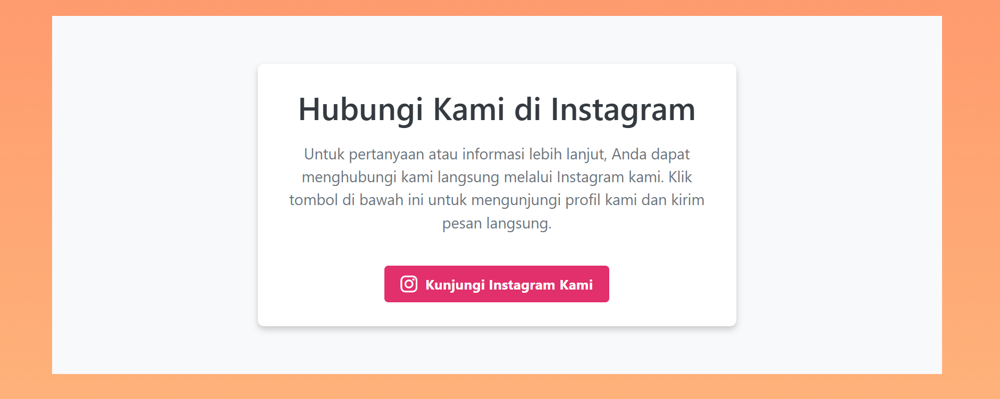

## Profil
| Variable | Isi |
| -------- | --- |
| *Nama* | AFRYAN DHINAR RESTU.P |
| *NIM* | 312310467    |
| *Kelas* | TI.23.A5 |
| *Mata Kuliah* | Pemograman Web |


### 1. Header:
```
Di bagian atas, terdapat teks "Selamat Datang di Halaman Saya!" dengan gaya font besar dan menarik, memberikan sambutan hangat kepada pengunjung.
Teks ini menggunakan font dekoratif dan ukuran yang cukup besar, dengan warna putih yang kontras dengan latar belakang oranye untuk membuatnya terlihat menonjol.
```
### 2. Konten Utama:
```
Bagian utama halaman berisi tiga kartu informasi atau card yang menampilkan gambar pemandangan matahari terbenam di lokasi berbeda, yaitu di jembatan, gunung, dan Monas.
```
### 3. Setiap kartu memiliki:
```
Gambar: Menampilkan gambar matahari terbenam di lokasi masing-masing. Gambar-gambar ini diletakkan di bagian atas setiap kartu, memberikan tampilan visual yang menarik.
```
### 3. Judul: 
```
Setiap kartu memiliki judul, seperti "Sunset on the bridge", "Sunset on the mountain", dan "Sunset at Monas".
```
### 4. Deskripsi: 
```
Di bawah judul, terdapat deskripsi singkat tentang gambar tersebut dalam bahasa Indonesia.
```
### 5. Tombol Aksi:
```
Di bagian bawah setiap kartu, terdapat tombol biru dengan teks "Lihat Selengkapnya" yang memberikan kesan interaktif. Tombol ini tampak seperti dapat diklik untuk membuka informasi lebih lanjut tentang gambar.
```
### 6. Footer atau Judul Bawah:
```
Di bagian bawah, terdapat teks besar bertuliskan "Halaman Home", yang mungkin bertindak sebagai judul atau footer dari halaman ini.
```
### 7. Warna dan Desain:
```
Latar belakang halaman berwarna oranye gradasi lembut, memberikan kesan hangat dan cocok dengan tema matahari terbenam.
Kartu memiliki sudut yang membulat, memberikan nuansa desain yang modern dan ramah.
Elemen teks dan tombol diatur dengan warna yang kontras untuk meningkatkan keterbacaan dan kenyamanan visual.
```


### 1. Tentang Kami: 
```
Teks ini menjelaskan bahwa tim ini merupakan pengembang web yang berdedikasi untuk menciptakan solusi digital terbaik bagi pengguna. Mereka memiliki pengalaman bertahun-tahun dalam merancang dan membangun situs web, aplikasi web, dan layanan digital lainnya.
```
### 2.Anggota Tim Kami:
``` 
Bagian ini memperkenalkan anggota tim bernama "Afryan" yang disebut sebagai mahasiswa dengan ketertarikan dalam pemrograman (dijelaskan sebagai "koding amatir"). Gambar profil menunjukkan sosok yang berdiri menghadap laut saat matahari terbenam, mungkin sebagai simbol ketertarikan pada teknologi dan alam.
```
### 3.Keahlian Kami: 
```
(Tidak ditampilkan sepenuhnya dalam gambar) tetapi kemungkinan berisi informasi tentang keahlian atau layanan yang ditawarkan tim ini.
```

### 1. Judul:
``` 
"Hubungi Kami di Instagram" menunjukkan bahwa tim ini menawarkan cara untuk berkomunikasi langsung melalui platform Instagram.
```
### 2. Deskripsi:
```
Halaman ini menjelaskan bahwa untuk pertanyaan atau informasi lebih lanjut, pengguna dapat menghubungi tim melalui Instagram. Teks mengarahkan pengguna untuk mengklik tombol di bawah untuk langsung mengunjungi profil Instagram tim tersebut.
```
### 3. Tombol Aksi: 
```
Ada tombol berwarna merah muda dengan ikon Instagram dan tulisan "Kunjungi Instagram Kami" yang dapat diklik untuk menuju halaman Instagram tim. Tombol ini memudahkan pengguna yang ingin terhubung dengan tim melalui media sosial.
```

### 1. Navigasi dan Pencarian: 
```
Di bagian atas, pengguna dapat memilih berapa banyak entri yang ingin ditampilkan per halaman (10, 25, dll.) dan menggunakan kolom "Search" untuk mencari data tertentu dalam tabel.
```
### 2. Kolom Data:
```
Name: Nama karyawan.
Position: Jabatan karyawan dalam perusahaan, seperti "System Architect," "Accountant," atau "Junior Technical Author."
Office: Kantor tempat karyawan bekerja, seperti Tokyo, San Francisco, New York, dan Edinburgh.
Age: Umur karyawan.
Start Date: Tanggal mulai karyawan bekerja di perusahaan.
Salary: Gaji karyawan yang ditampilkan dalam bentuk mata uang.
```
### 3. Data Karyawan: 
```
Tabel menampilkan informasi rinci tentang setiap karyawan, termasuk nama "Afryan Dhinar Restu Panggih" sebagai "System Architect" di kantor Tokyo dengan gaji tertinggi dalam daftar ($999,999).
```


### Alamat email : 
```
Formulir meminta alamat email pengguna dan memastikan bahwa “Kami tidak akan pernah membagikan email Anda dengan orang lain.”
```
### Kata sandi : 
```
Formulir meminta pengguna untuk memasukkan kata sandi.
```

```
Pesan “404 Tidak Ditemukan” di bagian bawah gambar tampaknya merupakan permainan dari pesan kesalahan “404 Tidak Ditemukan” yang umum yang biasanya ditampilkan ketika halaman web atau sumber daya tidak dapat ditemukan di situs web.
Dalam konteks ini, pesan “404 Tidak Ditemukan” tampaknya merupakan cara kreatif untuk menyampaikan bahwa konten yang ditampilkan bukanlah halaman utama, atau halaman yang “ditemukan” pada situs web. Ini kemungkinan merupakan halaman penampung atau halaman kesalahan yang ditampilkan saat pengguna mencoba mengakses bagian situs web yang tidak ada atau tidak lengkap.
```